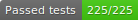

# Teletalk messenger (server)





[](https://app.fossa.com/projects/git%2Bgithub.com%2FS-STALWART-S%2Fteletalk-server?ref=badge_shield)
[](https://app.gitter.im/#/room/#teletalk-community:gitter.im)

## About

An app that offers a private messaging service with lots of bugs and insecure connections :D .

Currently it is written in `JavaScript`. There will be no `typescript` at this time, but some integration tests have been written to avoid most errors.

`ExpressJS` is used for web server development, `JWT` for authenticate, `MongoDB` for store user data and `Redis` is also used to store temporary stuffs.

I'm working on this project part-time and it is a hobby, But I have some interesting and exciting ideas for it in the future.

### Features

The following features are available:

- **add**, **edit** and **delete** contacts
- **add** users to blacklist, also **remove**
- **private chat**
- simple :)

## How to use

**Requirements**

Docker files are included. You can use docker or install these:

- NodeJS +16.x
- MongoDB +4.4
- Redis +6.x (with ReJSON modules)
- SMS Provider (only needed for production)

**Install node app dependencies**

```bash
npm install
```

or

```bash
yarn
```

All environments required to run **development** servers can be found in the environments folder.

### Running development server

**Start**

```bash
npm run start:dev
```

**Test**

```bash
npm run test:dev
```

### Running production server

**Setup SMS Provider**

An SMS provider is required to send verification codes to your clients.
You can buy your own or use the free ones and update functions and other things in the SmsClient class. The functionality of this class depends on your SMS provider.

**Setup production environments**

Create production.env in environments folder. Model the environment variables of development server and make changes in the value based on your needs.
The value of some of these environments depends on the program execution environment, the version of some dependencies and also your SMS provider

**Build**

```bash
npm run build
```

**Start**

```bash
npm run start:production
```

If you were lucky, you good to go :)

## License

[](https://app.fossa.com/projects/git%2Bgithub.com%2FS-STALWART-S%2Fteletalk-server?ref=badge_large)
