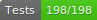

# Teletalk messenger (server)

<!-- [](https://github.com/S-STALWART-S/teletalk-server/actions/workflows/ci.yml) -->





<!-- [](https://github.com/marketplace/actions/super-linter) -->

### Technical details

The app is based on the ExpressJS NodeJS framework.

### Running locally

1. **Install node.js & npm.**
   Probably, you should use [nvm](https://github.com/nvm-sh/nvm).

2. **Install dependencies:**

```bash
npm install
```

or

```bash
yarn install
```

3. **Set environments**
   All required environments for run dev|test server existed on environments folder.

**Run app in development mode:**

```bash
npm run dev
```

**Run app tests:**

```bash
npm run test
```

**Run app in production mode:**

1. **Setup sms panel system:**
   A sms panel system needed for send verification code to clients. Buy for your own and set the settings and stuffs on SmsClient class (located in /src/classes)
2. **Setup .env file.**
   Create production.env on environments folder at root of project. Setup this environments:

- JWT_MAIN_SECRET for jwt main secret
- JWT_SIGN_IN_SECRET for verification secret
- MONGO_URL_PRODUCTION for your database (mongoDB) address

3. Start app:

```bash
npm start
```
